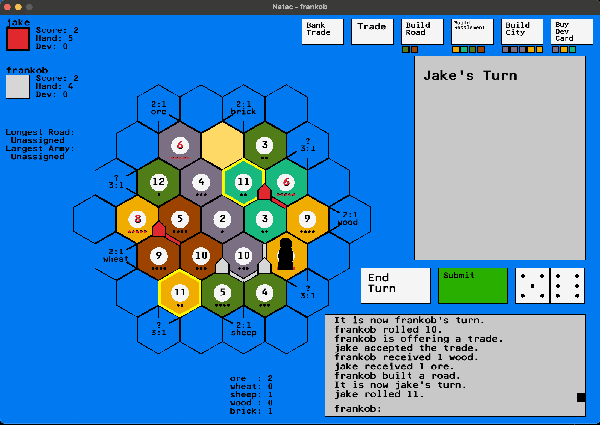

# natac

Free & open source networked game implemented in Python, inspired by Klaus Teuber's *Settlers of Catan* for MacOS and Linux.



Python 3.11.5 was the version used for development.

How to run the game from the terminal:

Create a virtual environment
```
python3 -m venv .venv (only do this for first time setup)
source .venv/bin/activate
```
The required modules are listed below:<br>
cffi==1.15.1<br>
inflection==0.5.1<br>
pycparser==2.21<br>
raylib==5.0.0.0<br>

Use this to install the requirements:
```
pip install -r requirements.txt
```
To start a server, include the IP address you want to use:
```
python3 main.py server IP_address
```
To start a client, type a username and include the IP address of the server:
```
python3 main.py username IP_address
```
To run the server locally:
```
python3 main.py server local
```
And to run the client locally:
```
python3 main.py username
```
